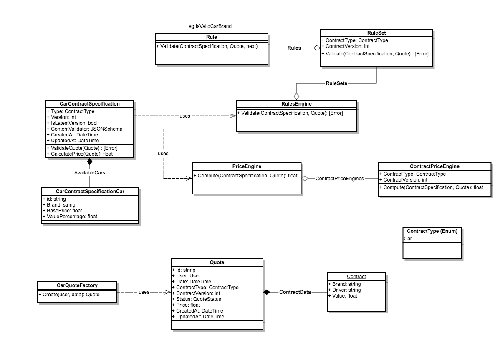

# interview-test

## How to run 
!! You need a local mongodb

- yarn
- Under server/_init run the initDb script (node initDb)
- npm start
- npm run front

## What is included
- A basic rules engine
- A basic compute engine
- REST body validation (JSON Schema validator)
- Exception handling
- Logging (winston)
- Security (JWT token)
- Contract versioning
- eslint
- A front in ReactJS + Redux + RXJS + Bootstrap

## What is not included
- Sending of an email (todo in service)
- Full unit tests (only rules and compute engine)

## Assumptions
In the description, we talked about contracts but we generate a quote in the frontend. I took the assumption that, based on that quote, we will create a contract later (out of scope). 

Based on that, I have modeled a CarContractSpecification that describe the structure of the contract (With a JSON Schema) and its additional data (like the brands we can insure). 

The contract specifications are versionned. When we create a quote, we always take the last version. The quote contains a reference to the contract specification it used. 

## Domain

- **CarContractSpecification**:  (versioned), contains the specification for the car contract.
When creating a quote or a contract (out of scope), we will use the ContentValidator (JSONSchema) to validate its content.

- **CarContractSpecificationCar**: Represent a car that the user is allowed to insure. It also contains the data in order to calculate the price.

- **RulesEngine**: Receive a contract specification and a set of data and process the validation with the rule sets (Validate a specific version)

- **PriceEngine**: Receive a contract specification and a set of data and process the price (Validate a specific version)

- **Quote**: Contains the quote data for a contract specification (generic)
